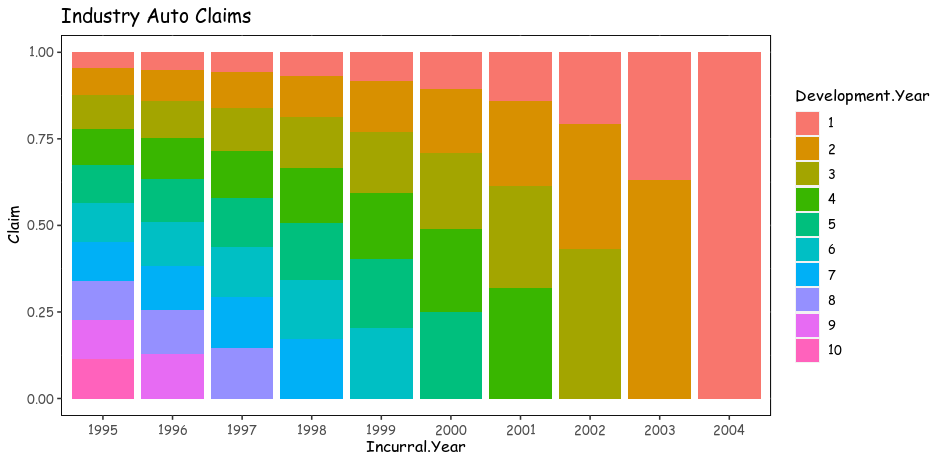
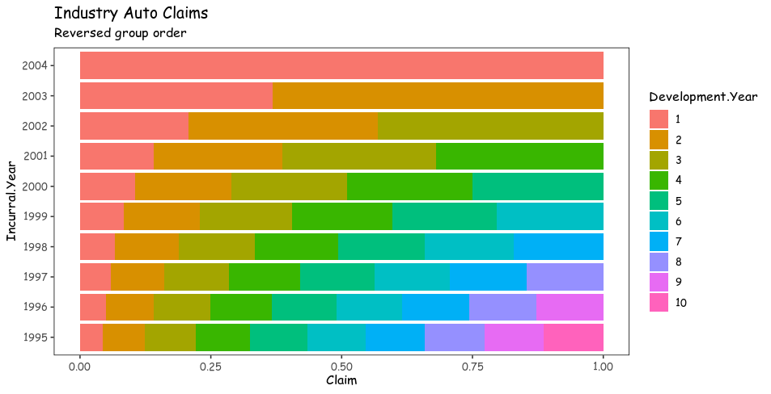

# ggshort

Shortly simplify the grammar of ggplot to the functions only with frequently used arguments.

<!-- badges: start -->

[](https://CRAN.R-project.org/package=ggshort) [](https://github.com/seokhoonj/ggshort/actions/workflows/R-CMD-check.yaml)

<!-- badges: end -->

## Installation

``` r
# install.packages("devtools")
devtools::install_github("seokhoonj/ggshort")
```

## Examples

### `ggbar()`

``` r
if (!require("insuranceData")) install.packages("insuranceData")

library(insuranceData)

data("AutoCollision")
head(AutoCollision)
#>   Age Vehicle_Use Severity Claim_Count
#> 1   A    Pleasure   250.48          21
#> 2   A  DriveShort   274.78          40
#> 3   A   DriveLong   244.52          23
#> 4   A    Business   797.80           5
#> 5   B    Pleasure   213.71          63
#> 6   B  DriveShort   298.60         171

ggbar(AutoCollision, x = Age, y = Claim_Count, fill = Vehicle_Use) + 
  labs(title = "Auto Collision") +
  theme_view()
```


### `ggbar()` with labels

``` r
ggbar(AutoCollision, x = Age, y = Claim_Count, fill = Vehicle_Use, 
      label = Claim_Count, label_size = 3, label_vjust = -.25) +
  labs(title = "Auto Collision with labels") + 
  theme_view()
```


### `ggline()`

``` r
if (!require("insuranceData")) install.packages("insuranceData")

library(insuranceData)

data("IndustryAuto")
head(IndustryAuto)
#>   Incurral.Year Development.Year Claim
#> 1          1995                1 17674
#> 2          1996                1 18315
#> 3          1997                1 18606
#> 4          1998                1 18816
#> 5          1999                1 20649
#> 6          2000                1 22327

# for grouping
IndustryAuto$Incurral.Year <- as.character(IndustryAuto$Incurral.Year)

ggline(IndustryAuto, x = Development.Year, y = Claim, group = Incurral.Year, 
       color = Incurral.Year) + 
  labs(title = "Industry Auto Claims") +
  theme_view()
```


### `ggpoint()`

``` r
if (!require("insuranceData")) install.packages("insuranceData")

library(insuranceData)

data("AutoCollision")
head(AutoCollision)
#>   Age Vehicle_Use Severity Claim_Count
#> 1   A    Pleasure   250.48          21
#> 2   A  DriveShort   274.78          40
#> 3   A   DriveLong   244.52          23
#> 4   A    Business   797.80           5
#> 5   B    Pleasure   213.71          63
#> 6   B  DriveShort   298.60         171

ggpoint(AutoCollision, x = Age, y = Claim_Count, color = Vehicle_Use, 
        size = Severity) + scale_y_comma() + labs(title = "Auto Collision") + 
        theme_view()
```


### `ggmix()`

``` r
if (!require("insuranceData")) install.packages("insuranceData")

library(insuranceData)

data("IndustryAuto")
head(IndustryAuto)
#>   Incurral.Year Development.Year Claim
#> 1          1995                1 17674
#> 2          1996                1 18315
#> 3          1997                1 18606
#> 4          1998                1 18816
#> 5          1999                1 20649
#> 6          2000                1 22327

# for grouping
IndustryAuto$Incurral.Year <- as.character(IndustryAuto$Incurral.Year)

IndustryAuto$Development.Year <- factor(IndustryAuto$Development.Year, levels = sort(unique(IndustryAuto$Development.Year)))

ggmix(IndustryAuto, x = Incurral.Year, y = Claim, fill = Development.Year) +
  labs(title = "Industry Auto Claims") +
  theme_view()
```



### `ggmix()` with reveresed group order

``` r
if (!require("insuranceData")) install.packages("insuranceData")

library(insuranceData)

data("IndustryAuto")
head(IndustryAuto)
#>   Incurral.Year Development.Year Claim
#> 1          1995                1 17674
#> 2          1996                1 18315
#> 3          1997                1 18606
#> 4          1998                1 18816
#> 5          1999                1 20649
#> 6          2000                1 22327

# for grouping
IndustryAuto$Incurral.Year <- as.character(IndustryAuto$Incurral.Year)

IndustryAuto$Development.Year <- factor(IndustryAuto$Development.Year, levels = sort(unique(IndustryAuto$Development.Year)))

ggmix(IndustryAuto, x = Incurral.Year, y = Claim, fill = Development.Year, 
      reverse = TRUE) +
  coord_flip() +
  labs(title = "Industry Auto Claims", subtitle = "Reversed group order") +
  theme_view()
```



### `ggpie()`

``` r
if (!require("insuranceData")) install.packages("insuranceData")

library(insuranceData)

data("AutoCollision")
data <- AutoCollision[AutoCollision$Age == "H",]
head(data)
#>    Age Vehicle_Use Severity Claim_Count
#> 29   H    Pleasure   192.00         260
#> 30   H  DriveShort   196.33         578
#> 31   H   DriveLong   259.79         312
#> 32   H    Business   342.58          96

# No theme_view, it already contains `theme_void()`
ggpie(data, group = Vehicle_Use, value = Claim_Count, label = Claim_Count) + 
      labs(title = "Auto Collision", subtitle = "Age: H")
```


### `plotly_pie()`

``` r
if (!require("insuranceData")) install.packages("insuranceData")

library(insuranceData)

data("AutoCollision")
data <- AutoCollision[AutoCollision$Age == "H",]
head(data)
#>    Age Vehicle_Use Severity Claim_Count
#> 29   H    Pleasure   192.00         260
#> 30   H  DriveShort   196.33         578
#> 31   H   DriveLong   259.79         312
#> 32   H    Business   342.58          96

# No theme_view, it already contains `theme_void()`
plotly_pie(data, labels = Vehicle_Use, values = Claim_Count) |>
      layout(title = "Auto Collision<br><sup>Age: H</sup>")
```


### `ggtable()`

``` r
if (!require("insuranceData")) install.packages("insuranceData")

library(insuranceData)
library(scales)

data("IndustryAuto")
head(IndustryAuto)
#>   Incurral.Year Development.Year Claim
#> 1          1995                1 17674
#> 2          1996                1 18315
#> 3          1997                1 18606
#> 4          1998                1 18816
#> 5          1999                1 20649
#> 6          2000                1 22327

IndustryAuto$Incurral.Year <- as.factor(IndustryAuto$Incurral.Year)
IndustryAuto$Development.Year <- as.factor(IndustryAuto$Development.Year)

ggtable(IndustryAuto, x = Development.Year, y = Incurral.Year, label = scales::comma(Claim)) +
  theme_view()
```


### `ggdensity()`

``` r
library(ggshort)

head(warpbreaks)
#>   breaks wool tension
#> 1     26    A       L
#> 2     30    A       L
#> 3     54    A       L
#> 4     25    A       L
#> 5     70    A       L
#> 6     52    A       L

ggdensity(data = warpbreaks, x = breaks, facet = .(wool, tension), 
  prob = c(.975)) + 
  labs(title = "Density of warpbreaks") +
  theme_view()
```


### `plotly_treemap()`

``` r
if (!require("insuranceData")) install.packages("insuranceData")

library(insuranceData)

data("AutoCollision")
head(AutoCollision)
#>   Age Vehicle_Use Severity Claim_Count
#> 1   A    Pleasure   250.48          21
#> 2   A  DriveShort   274.78          40
#> 3   A   DriveLong   244.52          23
#> 4   A    Business   797.80           5
#> 5   B    Pleasure   213.71          63
#> 6   B  DriveShort   298.60         171

plotly_treemap(AutoCollision, list(Age, Vehicle_Use), value_var = Claim_Count)
```


