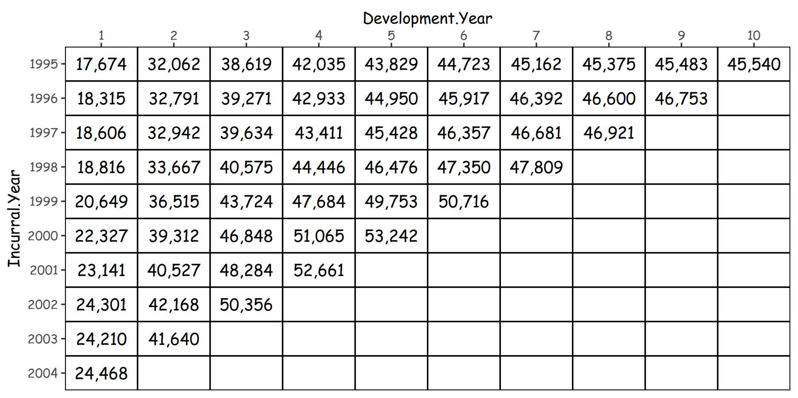

# ggshort

{width="30%"}

Shortly simplify the grammar of ggplot to the functions only with frequently used arguments.

[](https://CRAN.R-project.org/package=ggshort) [](https://github.com/seokhoonj/ggshort/actions/workflows/R-CMD-check.yaml)

## Installation

``` r
# install.packages("devtools")
devtools::install_github("seokhoonj/ggshort")
```

## 1. `ggplot2` shortly

This section introduces wrapper functions around `ggplot2` that make it easier to reuse common plotting patterns. They reduce boilerplate code (e.g., setting aesthetics, labels, themes) and provide sensible defaults, so you can focus on data and styling without rewriting long `ggplot2` calls.

------------------------------------------------------------------------

### 1) `ggbar()`

Draws quick bar plots for categorical x vs numeric y. fill maps groups, label adds value labels. Great for frequency/count comparisons.

``` r
if (!require("insuranceData")) install.packages("insuranceData")

library(ggplot2)
library(ggshort)
library(insuranceData)

data("AutoCollision")
head(AutoCollision)
#>   Age Vehicle_Use Severity Claim_Count
#> 1   A    Pleasure   250.48          21
#> 2   A  DriveShort   274.78          40
#> 3   A   DriveLong   244.52          23
#> 4   A    Business   797.80           5
#> 5   B    Pleasure   213.71          63
#> 6   B  DriveShort   298.60         171

ggbar(AutoCollision, x = Age, y = Claim_Count, fill = Vehicle_Use) + 
  ggplot2::labs(title = "Auto Collision") +
  theme_view()
```


### 1-2) `ggbar()` with labels

Adds text labels on top of bars. Useful for reports where exact values matter. label_args controls text size/position.

``` r
ggbar(AutoCollision, x = Age, y = Claim_Count, fill = Vehicle_Use, 
      label = Claim_Count, label_args = list(size = 3, vjust = -.25)) +
  ggplot2::labs(title = "Auto Collision with labels") + 
  theme_view()
```


### 2) `ggline()`

Line plot for trends over ordered/continuous x. group/color separates groups for easy pattern comparison. Insurance use case: visualize claim development by origin year.

``` r
if (!require("insuranceData")) install.packages("insuranceData")

library(ggplot2)
library(ggshort)
library(insuranceData)

data("IndustryAuto")
head(IndustryAuto)
#>   Incurral.Year Development.Year Claim
#> 1          1995                1 17674
#> 2          1996                1 18315
#> 3          1997                1 18606
#> 4          1998                1 18816
#> 5          1999                1 20649
#> 6          2000                1 22327

# for grouping
IndustryAuto$Incurral.Year <- as.character(IndustryAuto$Incurral.Year)

ggline(IndustryAuto, x = Development.Year, y = Claim, group = Incurral.Year, 
       color = Incurral.Year) + 
  scale_y_comma() +
  ggplot2::labs(title = "Industry Auto Claims") +
  theme_view()
```


### 3) `ggpoint()`

Scatter plot. color shows groups, size maps another numeric variable. Good for exploring relationships and variation.

``` r
if (!require("insuranceData")) install.packages("insuranceData")

library(ggplot2)
library(ggshort)
library(insuranceData)

data("AutoCollision")
head(AutoCollision)
#>   Age Vehicle_Use Severity Claim_Count
#> 1   A    Pleasure   250.48          21
#> 2   A  DriveShort   274.78          40
#> 3   A   DriveLong   244.52          23
#> 4   A    Business   797.80           5
#> 5   B    Pleasure   213.71          63
#> 6   B  DriveShort   298.60         171

ggpoint(AutoCollision, x = Age, y = Claim_Count, color = Vehicle_Use, 
  size = Severity) + 
  scale_y_comma() + 
  ggplot2::labs(title = "Auto Collision") + 
  theme_view()
    
# ggjitter()
# ggscatter()
```


### 4) `ggdensity()`

Density curves of a continuous variable. fill compares groups, prob adds quantile markers. Works well with facets.

``` r
library(ggplot2)
library(ggshort)

head(warpbreaks)
#>   breaks wool tension
#> 1     26    A       L
#> 2     30    A       L
#> 3     54    A       L
#> 4     25    A       L
#> 5     70    A       L
#> 6     52    A       L

ggdensity(data = warpbreaks, x = breaks, fill = tension, prob = c(.975)) + 
  ggplot2::labs(title = "Density of warpbreaks") +
  facet_wrap(~ wool) +
  theme_view()
```


### 5) `gghistogram()`

Histograms of a continuous variable. `fill` compares groups, `prob` adds quantile markers (shown as vertical lines and/or labels). Useful for visualizing distributions across categories or combined with facets.

``` r
library(ggplot2)
library(ggshort)

gghistogram(data = iris, x = Sepal.Length, color = Species, fill = Species,
            prob = c(.975)) + 
  ggplot2::labs(title = "Sepal.Length of iris") +
  theme_view()
```


### 6) `ggbox()`

Boxplot with quartiles, median, and outliers. label option overlays group labels on top. Handy for group distribution comparisons.

``` r
library(ggplot2)
library(ggshort)

ggbox(data = iris, x = Species, y = Sepal.Length, fill = Species, alpha = 1,
      label_args = list(vjust = -0.4), show_label = TRUE) +
  ggplot2::labs(title = "Boxplot of Sepal.Length") +
  theme_view()
```


### 7) `ggpie()`

Pie chart for proportions. Includes theme_void() by default for a clean look. Works best with a small number of categories.

``` r
if (!require("insuranceData")) install.packages("insuranceData")

library(ggplot2)
library(ggshort)
library(insuranceData)

data("AutoCollision")
data <- AutoCollision[AutoCollision$Age == "H",]
head(data)
#>    Age Vehicle_Use Severity Claim_Count
#> 29   H    Pleasure   192.00         260
#> 30   H  DriveShort   196.33         578
#> 31   H   DriveLong   259.79         312
#> 32   H    Business   342.58          96

# No theme_view, it already contains `theme_void()`
ggpie(data, group = Vehicle_Use, value = Claim_Count, label = Claim_Count) + 
  ggplot2::labs(title = "Auto Collision", subtitle = "Age: H")
```


### 8) `ggmix()`

Mixed stacked/grouped bar chart helper. Supports flip (horizontal/vertical) and reverse (reverse group order).

**Insurance use case**: visualize portfolio mix (e.g., age × gender × sum assured).

``` r
if (!require("insuranceData")) install.packages("insuranceData")

library(ggplot2)
library(ggshort)
library(insuranceData)

data("IndustryAuto")
head(IndustryAuto)
#>   Incurral.Year Development.Year Claim
#> 1          1995                1 17674
#> 2          1996                1 18315
#> 3          1997                1 18606
#> 4          1998                1 18816
#> 5          1999                1 20649
#> 6          2000                1 22327

# for grouping
IndustryAuto$Incurral.Year <- as.character(IndustryAuto$Incurral.Year)

IndustryAuto$Development.Year <- factor(IndustryAuto$Development.Year, levels = sort(unique(IndustryAuto$Development.Year)))

ggmix(IndustryAuto, x = Incurral.Year, y = Claim, fill = Development.Year, 
      flip = FALSE) +
  ggplot2::labs(title = "Industry Auto Claims") +
  theme_view()
```


### 8-2) `ggmix()` with reveresed group order

``` r
if (!require("insuranceData")) install.packages("insuranceData")

library(ggplot2)
library(ggshort)
library(insuranceData)

data("IndustryAuto")
head(IndustryAuto)
#>   Incurral.Year Development.Year Claim
#> 1          1995                1 17674
#> 2          1996                1 18315
#> 3          1997                1 18606
#> 4          1998                1 18816
#> 5          1999                1 20649
#> 6          2000                1 22327

# for grouping
IndustryAuto$Incurral.Year <- as.character(IndustryAuto$Incurral.Year)

IndustryAuto$Development.Year <- factor(IndustryAuto$Development.Year, levels = sort(unique(IndustryAuto$Development.Year)))

ggmix(IndustryAuto, x = Incurral.Year, y = Claim, fill = Development.Year, 
      reverse = TRUE, flip = TRUE) +
  ggplot2::labs(title = "Industry Auto Claims", subtitle = "Reversed group order") +
  theme_view()
```


### 9) `ggtable()`

Renders discrete × discrete layouts as table-like plots with labels. xlab_position moves axis labels to top/bottom.

**Insurance use case**: display claim triangles as formatted tables for export.

``` r
if (!require("insuranceData")) install.packages("insuranceData")

library(ggplot2)
library(ggshort)
library(insuranceData)
library(scales)

data("IndustryAuto")
head(IndustryAuto)
#>   Incurral.Year Development.Year Claim
#> 1          1995                1 17674
#> 2          1996                1 18315
#> 3          1997                1 18606
#> 4          1998                1 18816
#> 5          1999                1 20649
#> 6          2000                1 22327

IndustryAuto$Incurral.Year <- as.factor(IndustryAuto$Incurral.Year)
IndustryAuto$Development.Year <- as.factor(IndustryAuto$Development.Year)

ggtable(IndustryAuto, x = Development.Year, y = Incurral.Year,
        label = scales::comma(Claim), xlab_position = "top") +
  theme_view()
```



### 10) `theme_view()`, `theme_save()`, `theme_shiny()`, `switch_theme()`

#### **What they are**

-   **`theme_view()`** – a clean, on-screen theme for quick exploration. Transparent panel background, black panel border, configurable axis/legend/strip text. If you set `x.size` or `y.size` to `0`, the corresponding axis ticks are hidden.
-   **`theme_save()`** – a print/export-friendly theme (e.g., images, Excel). Comes with sensible text size defaults (`x.size = y.size = 12`, `t.size = 14`) for crisp output.
-   **`theme_shiny()`** – a dashboard-ready theme for Shiny. Transparent overall background by default; control with `plot.background.fill`.
-   **`switch_theme(theme, ...)`** – convenience wrapper to pick one of the above.

#### **Common controls (all three themes)**

-   `family` – font family (defaults to `getOption("ggshort.font")`).
-   `x.size, y.size, t.size, s.size, l.size` – font sizes for axis/title/strip/legend.
-   `x.face, y.face, t.face, s.face, l.face` – font faces (`"plain"`, `"bold"`, `"italic"`, `"bold.italic"`).
-   `x.angle, y.angle`, `x.hjust/x.vjust`, `y.hjust/y.vjust` – axis label orientation & alignment.
-   `legend.key.height/legend.key.width`, `legend.position` (`"none"`, `"left"`, `"right"`, `"bottom"`, `"top"`, `"inside"`), `legend.justification`.
-   Panel/strip styling: black border, transparent panel by default.

``` r
library(ggplot2)
library(ggshort)

p <- ggpoint(iris, x = Sepal.Length, y = Petal.Length, color = Species)

# Explore on screen
p + theme_view()

# Export with larger title
p + theme_save(t.size = 18)

# Shiny dashboard with light gray background fill
p + theme_shiny(plot.background.fill = "#F7F7F7")

# Switch
p + switch_theme(theme = "view", x.size = 0, y.size = 0)
```

## 2. Simple Plot functions

This section provides quick helper functions for common statistical plots. Unlike the `ggplot2 shortly` wrappers (which simplify standard geoms), these functions focus on **analytical plots** that often involve preprocessing:

------------------------------------------------------------------------

### 1) `plot_box()`

Supports variable selection in three ways:

-   Character: `"Sepal.Length"`
-   NSE: `Sepal.Length`
-   Numeric index: `1`

``` r
# Character vector selection
plot_box(
    iris, x_var = "Sepal.Length", color_var = "Species",  
    flip = TRUE, show_density = TRUE,
    palette = "Set1",
    title = "Boxplot of Sepal.Length"
)
```


### 2) `plot_density()`

Supports variable selection in three ways (character, NSE, numeric index). Useful for exploring distribution with optional quantile labels.

``` r
# Basic density by species with quantile labels
plot_density(iris, x_var = "Sepal.Length", color_var = "Species",
             probs = 0.9, show_label = TRUE,
             palette = "Set1",
             title = "Density plot of Sepal.Length")
```


### 3) `plot_histogram()`

Histograms of a continuous variable with optional grouping and quantile/mean/median guides. Can also show a small density panel (show_density = TRUE).

``` r
# Basic histogram by species with quantile labels
plot_histogram(iris, x_var = "Sepal.Length", color_var = "Species",
               probs = 0.9, show_label = TRUE,
               palette = "Set1",
               title = "Histogram of Sepal.Length")
```


### 4) `plot_pca()`

Supports variable selection in three ways (character, NSE, numeric index). Accepts multiple measurement variables for PCA.

``` r
# NSE selection (unquoted)
plot_pca(
    iris,
    measure_vars = c(Sepal.Length, Sepal.Width, Petal.Length, Petal.Width),
    color_var = Species, show_density = TRUE,
    palette = "Set2"
)
```


### 5) `plot_cor()`

Takes a **correlation matrix** (e.g., from `cor()`), and visualizes it with options to show the lower/upper triangle, diagonal, and value labels.

``` r
x <- cor(mtcars)

# Lower triangle with labels
plot_cor(x, display = "lower",  show_diag = TRUE, show_label = TRUE,
         title = "Correlation of mtcars")
```


### 6) `plot_meta()`

Takes a meta object created by `instead::meta()`. Summarizes metadata visually (variable class, distinct count, mode, etc.).

``` r
library(ggshort)
library(instead)

x <- instead::meta(mtcars)

plot_meta(instead::meta(mtcars))
plot(instead::meta(mtcars))  # alias for the same function
```


### 7) `plot_sample_size()`

Uses a sample_size object generated by `instead::compute_sample_size()` to visualize the required sample size for a given proportion.

``` r
library(ggshort)
library(instead)

x <- instead::compute_sample_size(p = 0.00513, r = 0.1)
plot_sample_size(x)
plot(x)  # alias for the same function
```


## 3. Statistical Layers

------------------------------------------------------------------------

### 1) `stat_mean_point()`, `stat_median_point()`

Adds the mean (○) and median (×) of the data as points on the plot. Useful for visualizing central tendency directly on scatterplots.

``` r
# Add both mean (red) and median (blue) points
ggpoint(iris, x = Petal.Length, y = Petal.Width, color = Species) +
  stat_mean_point(color = "red", size = 3) +
  stat_median_point(color = "blue", size = 3) +
  theme_view()
```


``` r
# Add both mean (red) and median (blue) points (by Species)
ggpoint(iris, x = Petal.Length, y = Petal.Width, color = Species) +
    stat_mean_point(aes(color = Species), shape = 1, size = 6) +
    stat_median_point(aes(color = Species), shape = 4, size = 6) +
    theme_view()
```


### 2) `stat_mean_hline()`, `stat_median_hline()`

Adds horizontal lines at the mean and median of the y-axis variable. Good for quickly comparing observations against overall levels.

``` r
# Add both mean (red) and median (blue) hline
ggpoint(iris, x = Sepal.Length, y = Petal.Length, color = Species) +
  stat_mean_hline(color = "red", linetype = "solid") +
  stat_median_hline(color = "blue", linetype = "dashed") +
  theme_view()
```


### 3) `stat_mean_vline()`, `stat_median_vline()`

Adds vertical lines at the mean and median of the x-axis variable. Helps to highlight vertical thresholds relative to data distribution.

``` r
# Add both mean (red) and median (blue) vline
ggpoint(iris, x = Sepal.Length, y = Petal.Length, color = Species) +
  stat_mean_vline(color = "red", linetype = "solid") +
  stat_median_vline(color = "blue", linetype = "dashed") +
  theme_view()
```


### 4) `stat_mean_line()`, `stat_median_line()`

Adds trend lines connecting groupwise means or medians across the x-axis. Useful for comparing central tendency trends across categories or time.

``` r
ggpoint(iris, x = Sepal.Length, y = Petal.Length, color = Species) +
  stat_mean_line(color = "red", linetype = "solid") +
  stat_median_line(color = "blue", linetype = "dashed") +
  theme_view()
```


### 5) `stat_density_qunatile_vline()`, `stat_density_quantile_text()`

These two functions are already supported internally in `ggdensity`, but **ggshort** provides them as explicit `stat_` layers so that they can be reused directly in custom `ggplot2` workflows.

``` r
library(ggplot2)
library(ggshort)

ggplot2::ggplot(iris, aes(x = Sepal.Length, fill = Species)) +
    ggplot2::geom_density(alpha = .6) +
    stat_density_quantile_vline() +
    stat_density_quantile_text(probs = .975, vjust = 2) +
    theme_view()
```


### 6) `stat_chull()`

Adds a convex hull (minimum bounding polygon) around groups of points. Useful for highlighting group boundaries in scatterplots.

``` r
# Convex hull
ggpoint(iris, x = Petal.Length, y = Petal.Width, color = Species) +
  stat_chull(aes(color = Species)) +
  theme_view()
```


## 4. Utilities

------------------------------------------------------------------------

### 1) `hstack_plots()`, `vstack_plots()`

Convenience functions to **horizontally (`hstack_plots`)** or **vertically (`vstack_plots`)** stack multiple ggplots.

**Key Features:**

-   Accepts multiple `ggplot` objects (or grobs).
-   Supports relative sizing via `widths` (for horizontal) or `heights` (for vertical).
-   Returns a grob by default, but can also **draw directly** (`draw = TRUE`).

``` r
library(ggshort)

p1 <- ggbox(iris, x = Species, y = Sepal.Length, fill = Species) +
    theme_view(y.size = 0)
p2 <- ggdensity(iris, x = Sepal.Length, fill = Species,
                label_args = list(angle = 90, hjust = 1.5)) +
    theme_view(y.size = 0)

# horizontal stack
hstack_plots(p1, p2, widths = c(1, 1), draw = TRUE)
```


``` r
library(ggshort)

p1 <- ggbox(iris, x = Species, y = Sepal.Length, fill = Species) +
  theme_view(y.size = 0)
p2 <- ggdensity(iris, x = Sepal.Length, fill = Species,
                label_args = list(vjust = 1.5)) +
  theme_view(y.size = 0)

# vertical stack
vstack_plots(p1, p2, heights = c(1, 1), draw = TRUE)
```


### 2) `hstack_plots_with_legend()`, `vstack_plots_with_legend()`

Combine two ggplot objects into a single figure with one shared legend. These helpers extract the legend (by default from the first plot) and place it to the right, while removing duplicate legends from the individual plots.

**When to use:**

-   You’ve got two related plots (e.g., boxplot + density) that share the same color/fill mapping and you want one tidy legend.

**Key features:**

-   **Shared legend** automatically taken from `plot1` (or pass a custom legend via `legend = get_legend(plot)`).
-   **Horizontal** (`hstack_*`) or **vertical** (`vstack_*`) layout.
-   **Axis cleanup**: `x_axis = FALSE` and/or `y_axis = FALSE` hides tick labels and ticks on both plots to reduce redundancy.
-   **Title/Subtitle/Caption** handling:
    -   `title` and `subtitle` are applied to **plot1** only (blanked in `plot2`).
    -   `caption` is applied to **plot2** only (blanked in `plot1`).
    -   Because of this split, you **cannot use long text** in these fields (it will get truncated, expecially, `vstack_plots_with_legend()`). For long titles, use `add_title()` instead.
-   **Size control** via `widths`/`heights` (relative units).

``` r
library(ggplot2)
library(ggshort)

# Two plots sharing the same color scale (Species)
p1 <- ggbox(iris, x = Species, y = Sepal.Length, fill = Species) +
  theme_view(y.size = 0)
p2 <- ggdensity(iris, x = Sepal.Length, fill = Species, show_label = FALSE) +
  theme_view(y.size = 0)

# Horizontal arrangement with a shared legend on the right
hstack_plots_with_legend(
  plot1  = p1,
  plot2  = p2,
  widths = c(4.25, 4.25, 1.5),     # left plot, right plot, legend
  title  = "Iris: Sepal Length",
  caption = "Data source: iris"
)
```


``` r
# Vertical arrangement with a shared legend on the right
vstack_plots_with_legend(
  plot1   = p1,
  plot2   = p2,
  heights = c(5, 5),               # top plot, bottom plot
  widths  = c(8.5, 1.5),           # combined plots, legend
  y_axis  = FALSE,                 # hide redundant y text/ticks
  subtitle = "Boxplot (top) + Density (bottom)"
)
```


### 3) `grob_to_ggplot()`

Convert a grid object (`grob` or `gtable`) into a `ggplot` object.

**Key behavior:**

-   If input is already a **ggplot**, it is returned unchanged.
-   If input is a **grob** or **gtable**, it is drawn inside an empty `ggplot` using `annotation_custom()`.
-   By default, it fills the entire plotting area (`xmin = -Inf, xmax = Inf, ymin = -Inf, ymax = Inf`).
-   Throws an error for unsupported input types.

``` r
library(ggshort)

p1 <- ggbox(iris, x = Species, y = Sepal.Length, fill = Species) +
  theme_view(y.size = 0)
p2 <- ggdensity(iris, x = Sepal.Length, fill = Species,
                label_args = list(vjust = 1.5)) +
  theme_view(y.size = 0)

# vertical stack
p <- vstack_plots(p1, p2, heights = c(1, 1))
p

# Convert to ggplot for integration
g <- grob_to_ggplot(p)
g
```

### 4) `get_legend()`

Extracts the legend (`guide-box`) grob from a **ggplot object**. This is useful when arranging multiple plots with a shared legend, or when you want to customize/save the legend separately.

``` r
library(ggshort)

p <- ggbox(iris, x = Species, y = Sepal.Length, fill = Species) +
  theme_view()
     
get_legend(p)
```

### 5) `add_title()`

Place a custom title grob **above a plot** (ggplot or gtable) by stacking it vertically. This is useful when a long or complex title doesn’t fit well inside `labs(title = ...)`, especially in combined layouts with shared legends.

**When to use:**

-   In functions like `hstack_plots_with_legend()` or `vstack_plots_with_legend()`, `title` and `subtitle` are forced into **plot1** and `caption` into **plot2**, which makes long text awkward. In such cases, use `add_title()` instead.

**Key features:**

-   Works with both `ggplot` objects and `gtable`s.
-   Title height relative to the plot is controlled by `heights` (default: `c(1, 9)`).
-   Supports custom font family (`family`), size, and justification (`hjust`, `vjust`).
-   Returns a **gtable** (use `grid::grid.draw()` to render if needed).

``` r
library(ggplot2)
library(ggshort)

# Two plots sharing the same color scale (Species)
p1 <- ggbox(iris, x = Species, y = Sepal.Length, fill = Species) +
  theme_view(y.size = 0)
p2 <- ggdensity(iris, x = Sepal.Length, fill = Species, show_label = FALSE) +
  theme_view(y.size = 0)

# Horizontal arrangement with a shared legend on the right
p <- hstack_plots_with_legend(
  plot1  = p1,
  plot2  = p2,
  widths = c(4.25, 4.25, 1.5)
)

# Add a long title above the plot
add_title(p, "IRIS Data Summary")

# or with pipe
p |> add_title(title = "IRIS Data Summary")
```


### 6) `set_ggshort_font()`, `get_ggshort_font()`

Manage the **default font family** used across `ggshort` themes and label helpers. The font is stored in the global option `"ggshort.font"`.

#### Key features

-   `set_ggshort_font(family)` Updates the default font. Verifies the font exists in [`systemfonts::system_fonts()`](https://cran.r-project.org/package=systemfonts). If not found, it reverts to the previous setting and issues a warning.
-   `get_ggshort_font()` Returns the currently set default font family.

#### Parameters

-   **family**: Character string giving the font family.
    -   Use `""` (empty string) or `NULL` to reset to system default.
    -   Must match a font listed in `systemfonts::system_fonts()`.

#### Return values

-   `set_ggshort_font()`: the font family (character scalar) that was set.
-   `get_ggshort_font()`: the current font family (character scalar).

``` r
library(ggshort)

# Set Comic Sans MS if available
set_ggshort_font("Comic Sans MS")

# Reset to system default
set_ggshort_font("")

# Get current font
get_ggshort_font()

# Use in a plot (inherits the global ggshort.font)
ggbar(iris, x = Species, y = Sepal.Length, fill = Species) +
  theme_view()
```

### 7) `scale_x_log()`, `scale_y_log()`

Apply a **logarithmic axis** with a **custom base**. Defaults to the natural log (`base = exp(1)`), but you can set any base (e.g., 2 or 10).

**Key features:**

-   Natural log by default (`base = exp(1)`).
-   Works on either axis: `scale_x_log()` or `scale_y_log()`.
-   Accepts all arguments of `scale_x_continuous()` / `scale_y_continuous()` (e.g., `breaks`, `labels`, `limits`).
-   Default labels are comma-formatted integers (`1,000`, `10,000`).

``` r
library(ggplot2)
library(ggshort)

# Natural log on X
ggpoint(mtcars, disp, mpg) +
  scale_x_log() +
  theme_view()

# Log base 2 on Y
ggpoint(mtcars, mpg, wt) +
  scale_y_log(base = 2) +
  theme_view()

# Log base 10 on both axes + custom breaks
ggpoint(mtcars, disp, hp) +
  scale_x_log(base = 10, breaks = c(100, 200, 400)) +
  scale_y_log(base = 10) +
  theme_view()
```

### 8) `scale_x_log_stay()`, `scale_y_log_stay()`

Apply a **log1p axis** (i.e., `log(1 + x)`) with **stay-specific breaks**. Designed for *length-of-stay* or similar right-skewed count data.

**Key features:**

-   Uses `log1p` transformation -\> keeps 0 safely on the axis.
-   Default breaks: common LOS cutoffs up to 90 days (`0, 1, 2, 3, 5, 7, 10, 14, 21, 28, 42, 60, 90`), then doubles thereafter (`180, 360, 720, …`) until the data max.
-   Works on either axis: `scale_x_log_stay()` or `scale_y_log_stay()`.
-   Accepts all arguments of `scale_x_continuous()` / `scale_y_continuous()` (e.g., `labels`, `limits`, `expand`).

``` r
library(ggshort)
library(tweedie)

tw <- tweedie::rtweedie(n = 1000, mu = 7, phi = 2, power = 1.5)
set.seed(123)
df <- data.frame(days = round(tw))
gghistogram(df, x = days, probs = .5) +
  scale_x_log_stay() +
  theme_view()
```

## 5. `Plotly` (Optional)

### 1) `plotly_pie()`

``` r
if (!require("insuranceData")) install.packages("insuranceData")

library(ggplot2)
library(ggshort)
library(insuranceData)
library(plotly)

data("AutoCollision")
data <- AutoCollision[AutoCollision$Age == "H",]
head(data)
#>    Age Vehicle_Use Severity Claim_Count
#> 29   H    Pleasure   192.00         260
#> 30   H  DriveShort   196.33         578
#> 31   H   DriveLong   259.79         312
#> 32   H    Business   342.58          96

# No theme_view, it already contains `theme_void()`
plotly_pie(data, labels = Vehicle_Use, values = Claim_Count) |>
  plotly::layout(title = "Auto Collision<br><sup>Age: H</sup>")
```


### 2) `plotly_treemap()`

``` r
if (!require("insuranceData")) install.packages("insuranceData")

library(ggplot2)
library(ggshort)
library(insuranceData)

data("AutoCollision")
head(AutoCollision)
#>   Age Vehicle_Use Severity Claim_Count
#> 1   A    Pleasure   250.48          21
#> 2   A  DriveShort   274.78          40
#> 3   A   DriveLong   244.52          23
#> 4   A    Business   797.80           5
#> 5   B    Pleasure   213.71          63
#> 6   B  DriveShort   298.60         171

plotly_treemap(AutoCollision, groups = list(Age, Vehicle_Use), values = Claim_Count)
```


